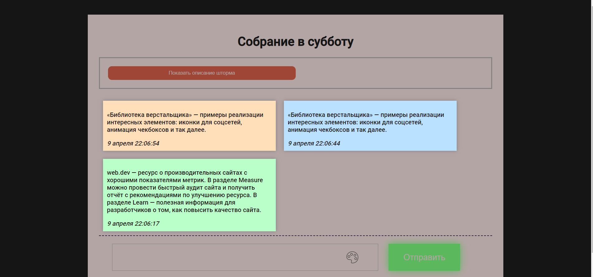

# **BrainStormed**
BrainStormed - это микро-платформа для обмена идеями пользователями.

Для того чтобы запустить файлы на локальном компьютере, загрузите файл с помощью GitHub, скачайте необходимые пакеты с помощью: 

`pip install -r requirements.txt`

После этого выполните команду 

`python manage.py upgrade`

И запустите Flask:

`python app.py`